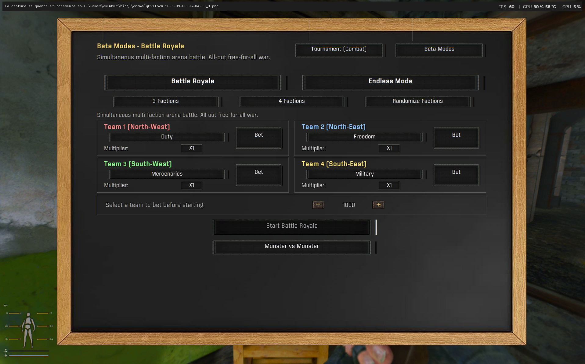
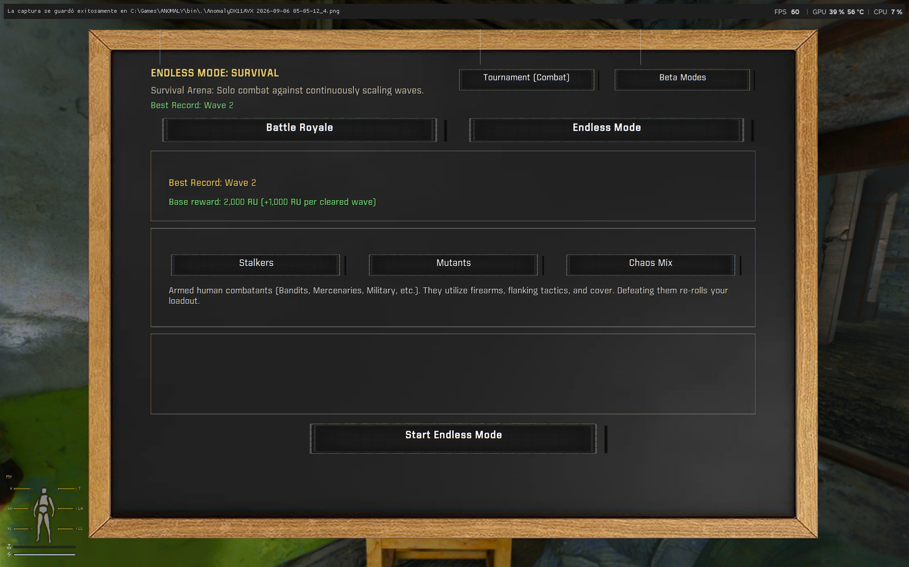

# Arena Tournament - S.T.A.L.K.E.R. Anomaly / G.A.M.M.A.

> **Version**: *1.1.1*  
> **Target Platform**: S.T.A.L.K.E.R. Anomaly / G.A.M.M.A. / GAMMA Mags Reloaded  
> **Engine used to create the mod**: [xray-monolith-bodycam](https://github.com/asuparabekon/xray-monolith-bodycam) engine fork  
> **Inspiration**: Based on and evolved from the original [Arena DLC (0.16)](https://www.moddb.com/mods/stalker-anomaly/addons/arena-dlc-01) by *xcvb* on ModDB.  
> **Changelog**: See [CHANGELOG.md](CHANGELOG.md) for full version history.

---

## Overview

**Arena Tournament** is a complete overhaul and expansion of the 100 Rads Bar Arena in Rostok for **S.T.A.L.K.E.R. Anomaly** and **G.A.M.M.A.** It transforms the arena into a living gladiator colosseum and betting entertainment hub with immersive mechanics, modular equipment selection, wave-based survival, high-stakes battle royales, and deep integration with popular overhaul mods like **GAMMA Mags Reloaded** and **ArtiGrok Ballistics**.

---

## Key Features

### 1. Full Tournament Combat Mode (Player In The Arena)
Compete directly in staged combat rounds against progressively harder combatants across multiple tiers:
- **5 Progressive Ranks**: Novices (Rookies), Hunters, Veterans, Masters, and Legends.
- **Two Battle Categories**:
  - **Stalkers (Humans)**: Face single duelists, tactical fireteams, armored squads, and elite exoskeletons with high-tier armaments.
  - **Zone Mutants**: Face packs of blind dogs, lurkers, bloodsuckers, psysuckers, controllers, chimeras, and legendary beasts.
- **Specific Weapon Selection & Cycling**:
  - Use the `<` and `>` arrow buttons to cycle through individual weapon models available for your selected tier and class.
- **Real-Time Loadout Summary Card**:
  - The right-hand summary box displays translated, authentic in-game names for your currently selected **Round**, **Weapon**, **Ammunition**, **Suit**, and **Helmet**.
- **Round Rewards & Replayability**:
  - Earn roubles (RU) and survival supplies upon victory.
  - Replay unlocked rounds at will to hone tactics or test loadouts.

---

### 2. ArtiGrok Ballistics & Special Ammunition Grid
- **Recommended Integration**: Designed with full support for [ArtiGrok-Ballistics-GAMMA-ilrath-Mo3](https://github.com/ilrathCXV/ArtiGrok-Ballistics-GAMMA-ilrath-Mo3), specifically **Arti's Special Ammo + Ammo Rebalance for GAMMA** ([Discord link](https://discord.com/channels/912320241713958912/1065168136577482753)).
- **Interactive Special Ammo Grid**:
  - When choosing the `Spec` ammo tier, an interactive 8-slot grid opens displaying all compatible special and overpressured (`+`) cartridges for your selected weapon.
  - Includes `<` and `>` pagination controls to browse through all available exotic rounds.
- **Smart Caliber Matching**:
  - Ammunition options strictly match the chambered caliber of the currently selected firearm.
- **Strict Quality Filtering**:
  - Broken, old (`_old`), and damaged (`verybad`) rounds are completely filtered out, ensuring you only receive genuine combat cartridges.
- **Modular MCM Toggle & Fallback**:
  - Configurable via the Mod Configuration Menu (`special_ammo_support`).
  - If ArtiGrok is not installed, the system automatically falls back to standard ammo handling with zero script errors.

---

### 3. Betting & Spectator Mode ("Apuestas")
Watch other gladiators fight from the VIP balcony overlooking the arena pit:
- **6 Concurrent Bout Cards**: Real-time bouts generated with dynamic odds and payouts.
- **Match Types & Filter Tabs**:
  - *All Matches*
  - *Stalkers vs Mutants (SvM)*
  - *Stalkers vs Stalkers (SvS)*
  - *Mutants vs Mutants (MvM)*
- **Canonical Enemy Matchmaking**: Factions are strictly paired based on lore hostility (e.g. Loners fight Bandits, Monolith, or Military; neutral/friendly factions will never be matched against each other).
- **Interactive Balcony**: Stand at the viewing railing to watch the AI firefights unfold with crowd sounds and victory announcements.

---

### 4. Beta Modes: Battle Royale
An all-out 4-faction brawl in the arena pit:
- **4 Faction Teams**: 4 squads (up to 30 combatants each) enter the arena simultaneously.
- **Dynamic Multi-Way Hostility**: Squads consider all other teams actively hostile, resulting in chaotic tactical firefights across the entire arena floor.
- **Spectator Wagering**: Place bets on which faction team will survive to the end, with real-time payout multipliers based on squad composition.

---

### 5. Beta Modes: Endless Mode ("Modo Infinito" / Survival)
A progressive wave survival challenge pushed to the limit:
- **Scaling Wave Difficulty**: Face escalating odds starting from 1v1 (Wave 1), 1v2 (Wave 2), 1v3 (Wave 3), scaling continuously.
- **3 Enemy Categories**:
  - **Stalkers**: Waves of human combatants with varied faction gear.
  - **Mutants**: Progressively stronger and larger packs of Zone beasts.
  - **Chaos**: Randomly mixed encounters with both mutants and armed stalkers.
- **Dynamic Equipment Rotation**:
  - Weapons, suits, helmets, and supplies are automatically re-rolled and granted at the start of every wave.
  - Generates standard `FMJ`, `AP`, and `HP` ammunition tailored to your assigned weapon.
- **Distributed 6-Point Arena Spawning**:
  - Enemies spawn across 6 distinct arena points with randomized coordinate jitter and safe vertex validation (`get_safe_arena_lvid`).
  - Completely eliminates enemy clumping and AI ceiling-levitation glitches.
- **Rewards, Healing & Evacuation**:
  - +40% health restoration upon clearing each wave.
  - Monetary reward: **2,000 RU base + 1,000 RU per wave cleared**.
  - Interactive evacuation menu between waves: bank your cash and exit safely, or risk it all for the next wave.
- **High Score Tracking**: Persistent recording of your personal best wave reached (`best_endless_wave`).

---

### 6. Full Support for G.A.M.M.A. Mags Reloaded
- Fully integrated with **Mags Reloaded**:
  - Automatically identifies compatible magazines for both primary and sidearm weapons.
  - Automatically loads and fills magazines with matching caliber ammunition.
  - Places extra loaded magazines directly into your tactical inventory.
  - Automatically chambers and prepares your primary weapon ready to fire the second you spawn in the arena pit.

---

### 7. Player Safe Storage & Gear Protection
- Entering the tournament temporarily transfers all your personal gear, artifacts, and weapons into a secure storage safe in Arnie's back room.
- Upon finishing the fight (victory, defeat, evacuation, or medical rescue), your exact inventory is safely and completely restored with zero lost items.

---

### 8. Immersive Knockout & Emergency Medic Rescue
- Rather than an abrupt teleport or game-over screen on fatal damage:
  - Input controls are immediately locked.
  - Camera collision physics and collapse animations are triggered (`surge_02.anm`).
  - Auditory moans and post-process death fade effects play (`actor_death.ppe`, `fade_in.ppe`).
  - You wake up on the floor of the Bar next to Arnie with the standing up animation (`wake_up.anm`), with Arnie and the bar medic treating your wounds for a medical fee (configurable via MCM).

---

### 9. AI Navigation & Arena Enforcement
- **Space Restrictor Enforcement**: Applied `bar_arena_restrictor` ensures NPCs remain inside the combat pit and never walk outside level boundaries.
- **ALife Isolation (`common = false`)**: Arena squads are isolated from the world simulation engine, preventing external task managers from commanding them to leave the arena.
- **Natural Raycast Vision**: Combatants use natural engine line-of-sight checks. No artificial visibility hacks—gladiators use real cover, flank, and shoot only when targets are physically visible.
- **Rock-Solid Victory Detection**: Engine-level member tracking ensures rounds only conclude when the last enemy has actually fallen.

---

### 10. Localization
Full multilingual text support:
- English (`eng`)
- Spanish (`spa`)
- Russian (`rus`)

---

## Installation & Requirements

1. **Mod Organizer 2 (MO2)** is recommended.
2. **Engine**: [xray-monolith-bodycam](https://github.com/asuparabekon/xray-monolith-bodycam) engine fork.
3. Install this mod folder into your `MODORGANIZER/mods` directory and enable it in your load order.

### Recommended Addons
- **ArtiGrok Ballistics for GAMMA**:  
  It is strongly recommended to use [ArtiGrok-Ballistics-GAMMA-ilrath-Mo3](https://github.com/ilrathCXV/ArtiGrok-Ballistics-GAMMA-ilrath-Mo3), specifically:
  > **Arti's Special Ammo + Ammo Rebalance for GAMMA**  
  > Available on the GAMMA Discord: [Arti's Special Ammo Channel](https://discord.com/channels/912320241713958912/1065168136577482753)  
  *Unlocks special overpressured (`+`) ammunition and custom exotic rounds accessible through the Tournament Special Ammo selector.*
- **G.A.M.M.A. Mags Reloaded**:  
  Provides automatic magazine loading, chambering, and tactical distribution in all arena bouts.

---

## Version History

For a comprehensive breakdown of all additions, adjustments, and fixes, check out the complete [CHANGELOG.md](CHANGELOG.md).

### Recent Highlights (v1.1.1)
- **Endless Mode**: Complete survival wave system with equipment swaps, multi-point spawning, and evacuation mechanics.
- **Battle Royale**: 4-faction free-for-all brawl with spectator wagering.
- **Special Ammo Grid**: Interactive 8-button caliber-matched ammo selector with pagination for ArtiGrok cartridges.
- **Loadout Summary**: Live translated summary card for selected weapons, ammunition, suits, and helmets.
- **Bug Fixes**: Fixed Endless Mode player invulnerability on replay, eliminated AI ceiling levitation, and expanded container hitboxes.

---

## Credits & Acknowledgments

- **Original Concept**: [Arena DLC (0.16)](https://www.moddb.com/mods/stalker-anomaly/addons/arena-dlc-01) by **xcvb**.
- **Engine Fork**: [xray-monolith-bodycam](https://github.com/asuparabekon/xray-monolith-bodycam) by **asuparabekon**.
- **Ballistics Overhaul**: **Arti** and **Grok** / **ilrathCXV** for *ArtiGrok Ballistics*.
- **Special Thanks**: The S.T.A.L.K.E.R. Anomaly and G.A.M.M.A. modding communities.
