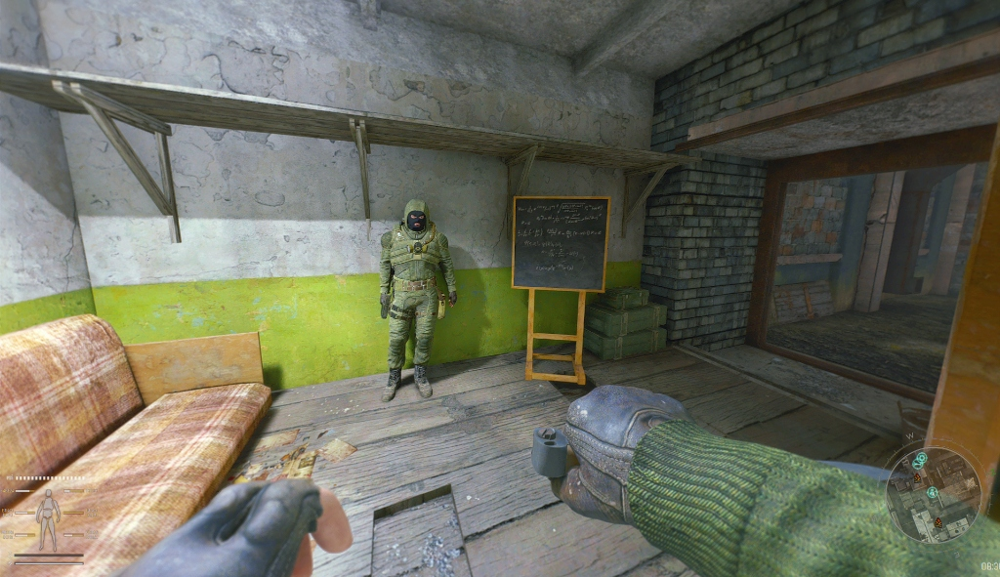
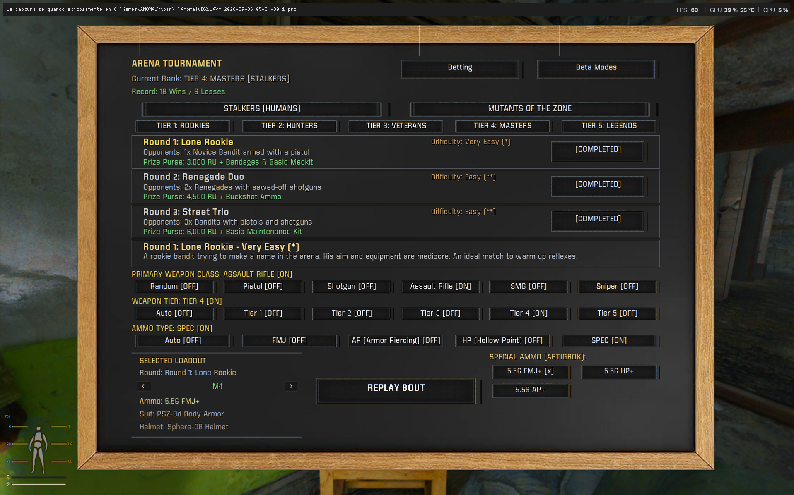
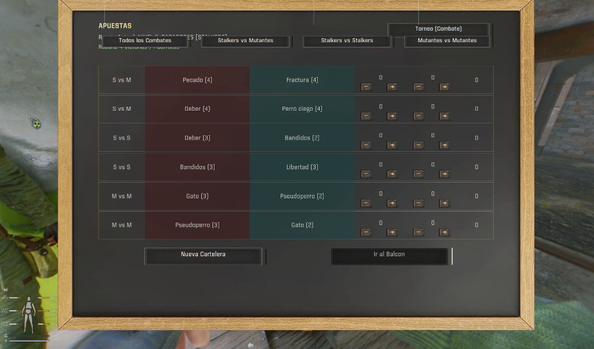

# Arena Tournament - S.T.A.L.K.E.R. Anomaly / G.A.M.M.A.

> **Status**: *Alpha Version*  
> **Target Platform**: S.T.A.L.K.E.R. Anomaly / G.A.M.M.A.  / GAMMA Mags Reloaded
> **Engine used to create the mod**: [xray-monolith-bodycam](https://github.com/asuparabekon/xray-monolith-bodycam) engine fork  
> **Inspiration**: Based on and evolved from the original [Arena DLC (0.16)](https://www.moddb.com/mods/stalker-anomaly/addons/arena-dlc-01) by *xcvb* on ModDB.

---

## Overview

**Arena Tournament** is a complete overhaul and expansion of the 100 Rads Bar Arena in Rostok for S.T.A.L.K.E.R. Anomaly and G.A.M.M.A. It transforms the arena into a comprehensive combat tournament and betting entertainment hub with immersive mechanics, full equipment handling, custom AI behavior, and deep integration with popular overhaul mods like **GAMMA Mags Reloaded**.

---

## Key Features

### 1. Full Tournament Combat Mode (Player In The Arena)
Compete directly in staged combat rounds against progressively harder combatants across multiple tiers:
- **5 Progressive Ranks**: Novices (Rookies), Hunters, Veterans, Masters, and Legends.
- **Two Battle Categories**:
  - **Stalkers (Humans)**: Face single duelists, tactical fireteams, armored squads, and elite exoskeletons with high-tier armaments.
  - **Zone Mutants**: Face packs of blind dogs, lurkers, bloodsuckers, psysuckers, controllers, chimeras, and legendary beasts.
- **Round Rewards & Replayability**:
  - Earn roubles (RU) and survival supplies (ammo, medical kits, cleaning materials) upon victory.
  - Replay unlocked rounds at will to hone tactics or test loadouts.

### 2. Dynamic Weapon Class & Loadout System
Before entering the arena, configure your combat loadout:
- **Weapon Class Selection**: Choose between **Random**, **Shotgun**, **Assault Rifle**, **Submachine Gun (SMG)**, or **Sniper Rifle**.
- **Correct Weapon Slotting**: Submachine guns, shotguns, assault rifles, and snipers correctly equip to the primary weapon slot (Slot 2 / `INV_SLOT_3`), while pistols and revolvers go to the secondary sidearm slot (Slot 1 / `INV_SLOT_2`), allowing proper reloading and swapping.
- **Tier Customization**: Choose between Auto (matching round tier) or manual loadout tiers (Tier 1 to Tier 5), equipping tailored suits, helmets, weapons, ammunition, and medical aid.

### 3. Full Support for G.A.M.M.A. Mags Reloaded
- Fully integrated with **Mags Reloaded**:
  - Automatically identifies compatible magazines for both primary and sidearm weapons.
  - Automatically loads and fills magazines with matching caliber ammunition.
  - Places extra loaded magazines directly into your tactical inventory.
  - Automatically chambers and prepares your primary weapon ready to fire the second you spawn in the arena pit.

### 4. Player Safe Storage & Gear Protection
- Entering the tournament temporarily transfers all your personal gear, artifacts, and weapons into a secure storage safe in Arnie's back room.
- Upon finishing the fight (victory, defeat, or medical rescue), your exact inventory is safely and completely restored with zero lost items.

### 5. Immersive Knockout & Emergency Medic Rescue
- Rather than an abrupt teleport or game-over screen on fatal damage:
  - Input controls are immediately locked.
  - Camera collision physics and collapse animations are triggered (`surge_02.anm`).
  - Auditory moans and post-process death fade effects play (`actor_death.ppe`, `fade_in.ppe`).
  - You wake up on the floor of the Bar next to Arnie with the standing up animation (`wake_up.anm`), with Arnie and the bar medic treating your wounds for a medical fee (configurable via MCM).

### 6. Betting & Spectator Mode ("Apuestas")
Watch other gladiators fight from the VIP balcony overlooking the arena:
- **6 Concurrent Bout Cards**: Real-time bouts generated with dynamic odds and payouts.
- **Match Types & Filter Tabs**:
  - *All Matches*
  - *Stalkers vs Mutants (SvM)*
  - *Stalkers vs Stalkers (SvS)*
  - *Mutants vs Mutants (MvM)*
- **Canonical Enemy Matchmaking**: Factions are strictly paired based on lore hostility (e.g. Loners fight Bandits, Monolith, or Military; neutral/friendly factions like Loners vs Ecologists will never be matched against each other).
- **Interactive Balcony**: Stand at the viewing railing to watch the AI firefights unfold with crowd sounds and victory announcements.

### 7. AI Navigation & Anti-Wallhack Polish
- **Space Restrictor Enforcement**: Applied `bar_arena_restrictor` ensures NPCs remain inside the combat pit and never levitate or walk outside level boundaries.
- **ALife Isolation (`common = false`)**: Arena squads are isolated from the world simulation engine, preventing external task managers from commanding them to leave the arena.
- **Natural Raycast Vision**: Combatants use natural engine line-of-sight checks. No artificial visibility hacks—gladiators use real cover, flank, and shoot only when targets are physically visible.
- **Rock-Solid Victory Detection**: Engine-level member tracking (`squad:npc_count() - 1 <= 0`) ensures rounds only conclude when the last enemy has actually fallen.

### 8. Localization
Full multilingual text support:
- English (`eng`)
- Spanish (`spa`)
- Russian (`rus`)

---

## Installation & Requirements

1. **Mod Organizer 2 (MO2)** is recommended.
2. **Engine used to create the mod**: [xray-monolith-bodycam](https://github.com/asuparabekon/xray-monolith-bodycam) engine fork.
3. Install this mod (`Arena_Tournament.zip`) into your `MODORGANIZER/mods` folder and enable it in your load order.
4. Ensure compatibility with **G.A.M.M.A. Mags Reloaded** (if enabled in your profile).

---

## TODO

- Fix a bug where a team sometimes wins automatically immediately after a bet is placed.
- Fix AI behavior so mutants properly attack each other during Mutant vs Mutant (MvM) matches.

---

## Credits & Acknowledgments

- **Original Concept**: [Arena DLC (0.16)](https://www.moddb.com/mods/stalker-anomaly/addons/arena-dlc-01) by **xcvb**.
- **Engine Fork**: [xray-monolith-bodycam](https://github.com/asuparabekon/xray-monolith-bodycam) by **asuparabekon**.
- **Special Thanks**: The S.T.A.L.K.E.R. Anomaly and G.A.M.M.A. modding communities.
